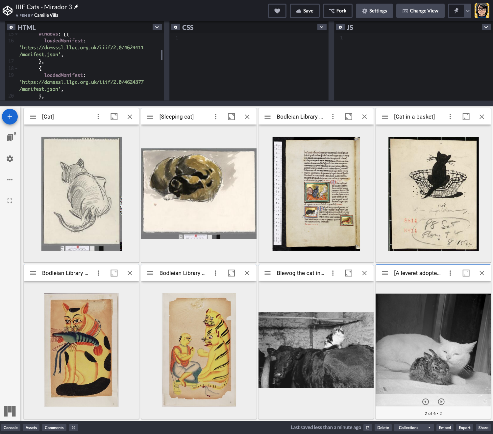

## Meowifests 🐈
A collection of IIIF manifests featuring cats.

PRs welcome!

### Mirador 3 example 🐱 🖼
A Mirador 3 instance configured to display canvases with cats!
[Codepen](https://codepen.io/cazilla11/pen/LvKQXa)

### Simple manifest list 📝
Note: Proper IIIF-ing coming soon
- [Bodleian, [f. 2 Cat (with Vaishnavite mark on forehead) with crayfish: perhaps represents a Bengali proverb or satire on religion]
](https://iiif.bodleian.ox.ac.uk/iiif/manifest/e32a277e-91e2-4a6d-8ba6-cc4bad230410.json)
  - canvasIndex: 1
- [Bodleian, [f. 11 A brahmin kneeling before two tigers - meaning uncertain]](https://iiif.bodleian.ox.ac.uk/iiif/manifest/e32a277e-91e2-4a6d-8ba6-cc4bad230410.json)
  - canvasIndex: 10
- [Bodleian, MS. Ashmole 1511, Bestiary](https://iiif.bodleian.ox.ac.uk/iiif/manifest/faeff7fb-f8a7-44b5-95ed-cff9a9ffd198.json)
  - canvasIndex: 75
- [National Library of Wales, [Cat]](https://damsssl.llgc.org.uk/iiif/2.0/4624411/manifest.json)
- [National Library of Wales, [Cat, sitting]](https://dams.llgc.org.uk/iiif/2.0/4624381/manifest.json)
- [National Library of Wales, [Sleeping cat]](https://damsssl.llgc.org.uk/iiif/2.0/4624377/manifest.json)
- [National Library of Wales, [Cat in a basket]](https://damsssl.llgc.org.uk/iiif/2.0/4887640/manifest.json)
- [National Library of Wales, Blewog the cat insisting on sleeping with Blaci the cow on Hywel Roberts' farm at Llandderfel](https://damsssl.llgc.org.uk/iiif/2.0/1556378/manifest.json)
- [National Library of Wales, [A leveret adopted by a cat]](https://damsssl.llgc.org.uk/iiif/2.0/1487439/manifest.json)
- [American Numismatic Society, Bronze Medal of Society of Medalists, Danbury (Conn.). 1987.159.1](http://numismatics.org/search/manifest/1987.159.1)
- [Biblissima, Chats - Collection d'ima…et décors de manuscrits](http://beta.biblissima.fr/iiif/manifest/ark:/43093/desc46da9b4e1ce16723d7fd94e8f36b0a6fbb250223)
- [Wikipedia](https://wikipedia-to-iiif.ch.digtest.co.uk/iiif/Cat)
